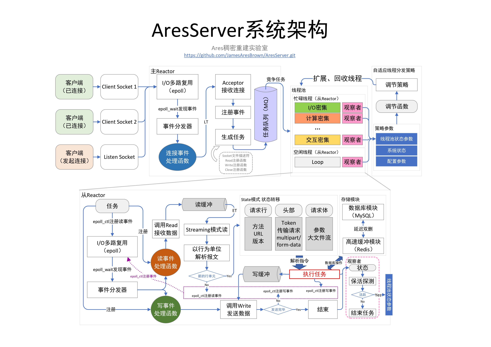

# AresServer

# 系统架构



# 使用


# 使用Docker

**强烈建议使用Docker来构建调试与运行环境！**

### 构建主服务器运行环境镜像：aresubuntu:2.0

使用Dockerfile文件构建运行时Linux环境（版本：ubuntu18.04），在Docker目录下除了Dockerfile文件，hiredis和redis-plus-plus是两个有关redis客户端的重要组件，需要在构建镜像的时候进行编译安装，由于在Dockerfile文件中使用指令：

```dockerfile
RUN git clone https://github.com/...
```

可能会因构建环境的网络问题导致拉取异常，所以这里准备好了两个重要组件的源码，注意：**这两个文件夹需要和Dockerfile在同一目录下！**。

构建指令：

进入Dockerfile所在目录

```shell
docker build -t aresubuntu:2.0 .
```

镜像名最好取名为 aresubuntu:2.0 ，这与提供的一键启动脚本相同。接下来需要搭建运行与调试环境，项目源码会被放置在对应的数据卷中进入构建的aresubuntu:2.0镜像容器中。

### 其他镜像

除了上面提到的aresubuntu:2.0需要手动构建，其他镜像只需要直接拉取：

```shell
docker pull mysql:5.7
docker pull redis:6.0.8
```

执行

```shell
docker images
```

如果能看见：

```shell
REPOSITORY   TAG       IMAGE ID       CREATED        SIZE
aresubuntu   2.0       9----------d   9 hours ago    2.59GB
mysql        5.7       c----------3   2 years ago    448MB
redis        6.0.8     1----------4   3 years ago    104MB
```

那么镜像都已经准备完毕。

### 数据卷

https://github.com/JamesAresBrown/aresserver_runtimeenv.git

针对以上环境，该地址提供了一个已经构建好的容器卷结构，其中有三个目录分别是musql、redis、server，以这些目录所在的地址作为数据卷根目录。以上目录中包含各个组件的配置文件和持久化数据（包含mysql需要的表结构），所包含的数据已经针对版本的镜像完成了对应的配置。

### 启动脚本

启动脚本（ares_start.sh）可以一键启动运行环境容器并在容器中启动AresServer。目前该脚本有两种调用方式：

1. 启动：

   ```shell
   ares_start.sh start [数据卷根目录]
   ```

2. 停止：

   ```shell
   ares_start.sh stop
   ```

数据卷地址是唯一需要提供的参数，观察脚本可以发现，很多数据卷的地址结构是固定的，所以**建议直接使用**

[该项目]: https://github.com/JamesAresBrown/aresserver_runtimeenv.git

**作为数据卷！**其中针对aresubuntu:2.0：

```dockerfile
docker run -it -d -p 22201:22 -p 80:80 \
	  # 1.持久化数据、执行文件、源码数据卷
      -v $BASE_PATH/server:/tmp/data \ 
      # 2.自启动脚本数据卷
	  -v $BASE_PATH/server/AresServer/script/auto_restart_server.sh:/tmp/start.sh \
	  # 3.编码调试环境数据卷
	  -v $BASE_PATH/server/codingenv:/codingenv \
      --name $UBUNTU_CONTAINER_NAME \
      aresubuntu:2.0
```


1. 持久化数据、执行文件、源码数据卷

   该数据卷下包含两个初始为空的文件夹：material与result，这是服务器持久化数据需要的文件夹结构。建议AresServer源码在该数据卷地址（server）下拉取并编译，生成的可执行文件（Server14）的地址需要用来配置自启动脚本（auto_restart_server.sh）。1

2. 自启动脚本数据卷

   该脚本在AresServer中，用于配合aresubuntu:2.0开机启动服务器。

3. 编码调试环境数据卷

   如果需要导入类似CLion的编码工具环境，那么这些环境可以放在第三个文件中：codingenv，默认情况下这个文件夹是不存在的。

4. config.ini

   服务器启动需要的配置文件。

### auto_restart_server.sh与config.ini

自启动脚本（auto_restart_server.sh）与配置文件（config.ini）是连接服务器与容器的桥梁，中间有许多参数可能更具环境的变化与调试的进行而改变。

**关键的！**在auto_restart_server.sh中：

```shell
# 可执行文件地址
EXECUTABLE_PATH="/tmp/data/AresServer/cmake-build-debug-ubuntu_aresserver/Server14"
# 配置文件地址
CONFIG_PATH="/tmp/data/config.ini"
# material地址
LOAD_FILE_PATH="/tmp/data/material/"
# result地址
RES_FILE_PATH="/tmp/data/result
```

联系数据卷的设置，这里的地址要严格和数据卷的设计对应，除了EXECUTABLE_PATH参数，其他参数需要严格根据ares_start.sh来设计，EXECUTABLE_PATH根据具体生成的可执行文件地址来设置。

**关键的！**在config.ini中：

```
[SERVER]
# 资源文件地址（网页，图片）
ROOT_PATH = "/tmp/data/AresServer/root/"
# 持久化地址（material与result所在的地址）
DATA_PATH = "/tmp/data/"
[MYSQL]
URL = "[xxx.xxx.xxx.xxx]"
USER = "[user]"
PASSWORD = "[passward]"
DATABASENAME = "test"
PORT = 3306
[REDIS]
URL = "tcp://[xxx.xxx.xxx.xxx]:6379?password=[password]"
```

其中[ ]包围的部分需要根据环境配置。

